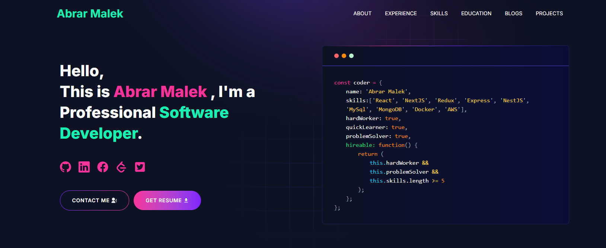

<p align="center" width="100%">
    
</p>

<h1 align="center">My Portfolio</h1>

<p align="center">
  <strong>A modern and responsive developer portfolio website</strong>
</p>

<p align="center">
  
  
  
</p>

---

# 🚀 Portfolio Website

This is my personal developer portfolio built using:

- Next.js
- React
- Tailwind CSS

It includes:

- About section
- Skills section
- Projects showcase
- Contact form
- Responsive design

---

## 📸 Preview

<p align="center">
  
</p>

---

## 🛠 Installation

```bash
npm install
npm run dev